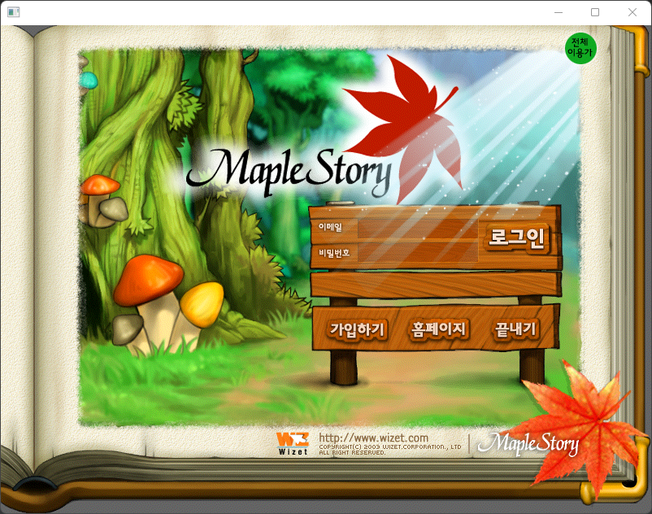
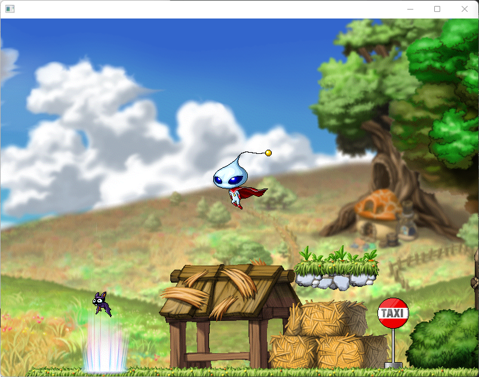
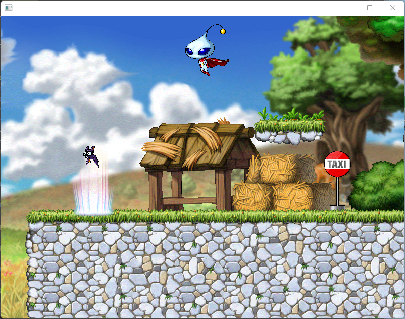

# WvsApp
`2020 컴퓨터네트워크 프로젝트`

---
### 주제
* 자바소켓을 이용한 TCP/IP 통신 프로그램 제작

### 개요
* 자바소켓으로 통신해 멀티플레이가 가능한 메이플스토리 클론 프로젝트

### 요구사항
* 메이플스토리 Ver.1.2.1 Data.wz 파일이 필요합니다.
* 로그인, 게임서버와의 연결이 필요합니다.

### 통신방식
* 데이터들을 바이트 직렬화 하여 송수신합니다.

* 통신데이터 구조

|||
|---|---|
|번호|short|
|보낼 데이터|자료형|
|...|...|

예시)   
``
PacketWriter packet = new PacketWriter(128);   
packet.writeShort(0x01);   
packet.writeString(tfEmail.getText());   
packet.writeString(pfPassword.getText());   
app.sendPacket(packet.getPacket());   
``

### 설명

로그인 화면입니다.

로그인 서버에서 아이디와 비밀번호를 확인 후 게임서버에 연결하고 게임화면으로 변경됩니다.

 

|플레이어1|플레이어2|
|---|---|
|||

게임 화면입니다.

맵과 플레이어들이 렌더링 됩니다. 방향키를 이용해 캐릭터를 움직일 수 있습니다.

포탈을 통해 다른 맵으로 이동할 수 있습니다.
